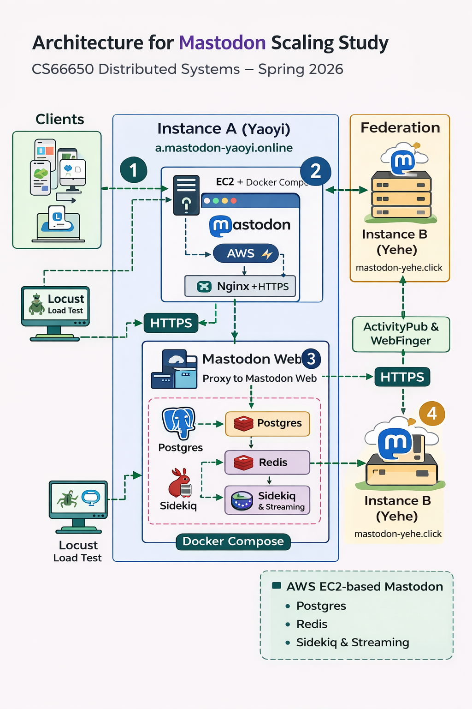

# Mastodon Scaling Study
### CS6650 Distributed Systems — Spring 2026
**Team:** Yaoyi Wang & Yehe Yan

---

## Overview

This project studies how a federated social network behaves under load using Mastodon as a case study.

Our original plan was to deploy Mastodon with a CloudFormation / ECS-based AWS architecture, generate traffic with Locust, and analyze system behavior under load. Because AWS Academy Learner Lab introduced major deployment restrictions, we pivoted to a simpler EC2 + Docker Compose deployment path.

So far, the project focuses on:

1. **Single-instance bottleneck** — which component becomes the bottleneck first under load?
2. **Vertical scaling** — how does instance size (t3.medium vs t3.large) affect throughput under identical load?
3. **Horizontal scaling** — how does adding web workers affect throughput and latency?
4. **Minimal federation feasibility** — can a lightweight EC2-hosted Mastodon instance participate in a basic cross-instance federation workflow?

---

## Architecture Overview

<p align="center">
  
</p>

---

## Current Status

- The original CloudFormation / ECS deployment path was blocked by Learner Lab IAM and nested-stack limitations.
- We pivoted to a **single EC2 + Docker Compose** deployment.
- Both instances pivoted to **EC2 + Docker Compose** with Nginx + HTTPS via Let's Encrypt.
- **Instance A** (Yaoyi): `a.mastodon-yaoyi.online` — t3.medium (4GB RAM) - anonymous read test, 0 failures up to 500 users.
- **Instance B** (Yehe): `mastodon-yehe.click` — t3.large (8GB RAM) - authenticated API test, rate limiter at 20+ users.
- Both instances running Mastodon v4.5.7 with PostgreSQL 14 + Redis 7 in Docker.

## Repository Structure

```text
mastodon-scaling-study/
├── README.md
├── docker-compose.yml  # EC2 Docker Compose deployment (replaces CloudFormation after IAM restrictions)
├── cloudformation/
│   ├── v1-no-ses.yml
│   ├── v2-no-ses-no-cloudfront-s3-public.yml
│   ├── v3-no-ses-no-cloudfront-no-s3.yml
│   ├── v4-http-only.yml
│   └── v5-http-only-flowlog-false.yml
├── infra/
│   └── cloudwatch-dashboard.json
├── locust/
│   ├── locustfile.py
│   ├── locustfile_yehe.py    # yehe's locustfile stress tests
│   └── federation_test.py
├── report/
│   └── mastodon_plan.md
└── results/
    ├── yaoyi/
    │   ├── notes.md
    │   ├── experiment_1_single_instance.md
    │   ├── experiment_2_federation.md
    │   └── screenshots/
    └── yehe/
        ├── locust_results
        ├── screenshots
        └── week1_notes.md


```

## Next Steps
- [ ] Disable rate limiting (`RACK_ATTACK_ENABLED=false`) and rerun 50-user test to find true hardware saturation point
- [ ] Horizontal scaling experiment: `docker compose up --scale web=2` and measure throughput improvement
- [ ] Vertical scaling comparison: run identical Locust workload on Instance A (t3.medium) and Instance B (t3.large)
- [ ] Redis / Sidekiq queue depth monitoring during no-rate-limit experiments
- [ ] Federation propagation latency measurement between Instance A and B
- [ ] Consolidate both teammates' results into final report
- [ ] Prepare slides / presentation materials

See [report/mastodon_plan.md](report/mastodon_plan.md) for the detailed project plan.