# Results and Graphs
## Mastodon Scaling Study — CS6650 Spring 2026
**Team:** Yaoyi Wang & Yehe Yan

---

## Architecture Overview

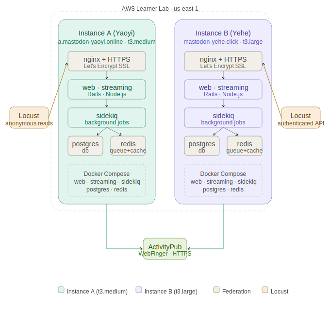

| | Instance A (Yaoyi) | Instance B (Yehe) |
|---|---|---|
| Domain | `a.mastodon-yaoyi.online` | `mastodon-yehe.click` |
| EC2 | t3.medium (2 vCPU, 4GB RAM) | t3.large (2 vCPU, 8GB RAM) |
| Workload | Anonymous read-heavy | Authenticated API (read + write) |
| Stack | EC2 + Docker Compose + Nginx + HTTPS | EC2 + Docker Compose + Nginx + HTTPS |

---

## Experiment 1 — Single Instance Bottleneck (Instance A, Yaoyi)

**Workload:** Anonymous read traffic — `/`, `/about`, `/explore`, `/health`
**Tool:** Locust

### Deployment — Instance Running

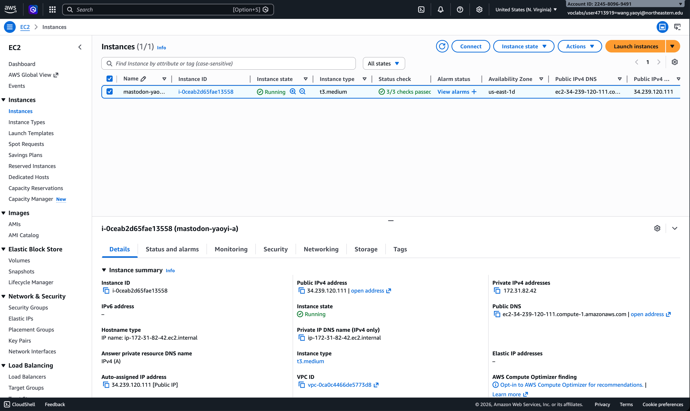

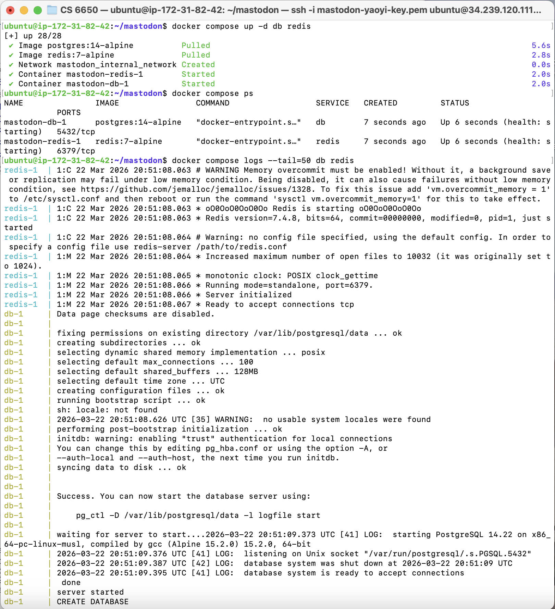

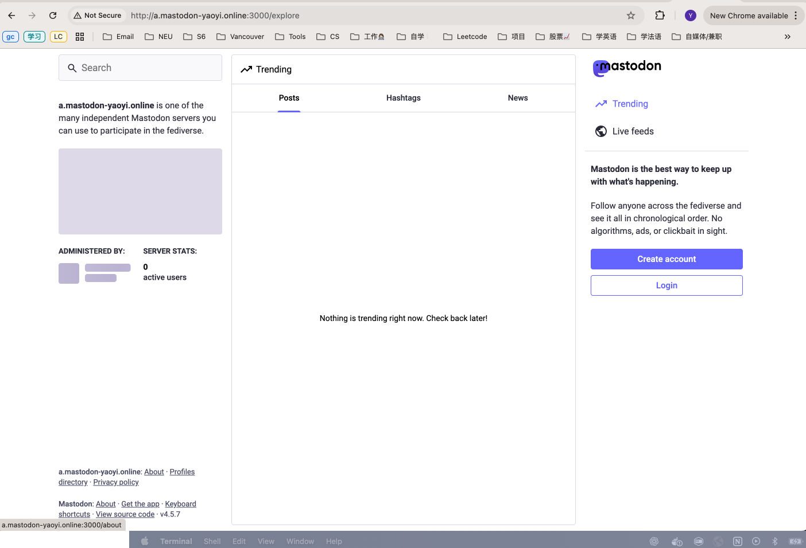

---

### Load Test Results

#### 5 Users

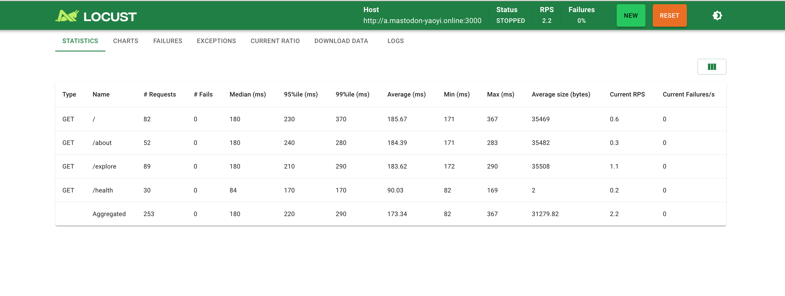

#### 20 Users

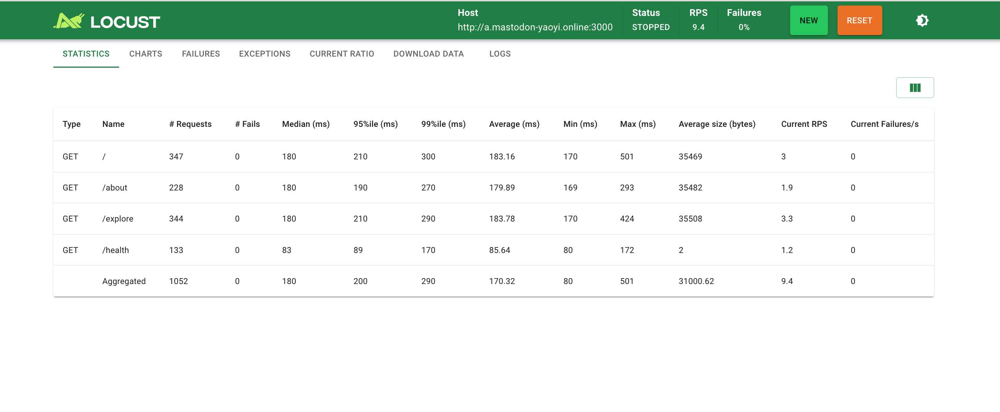

#### 50 Users

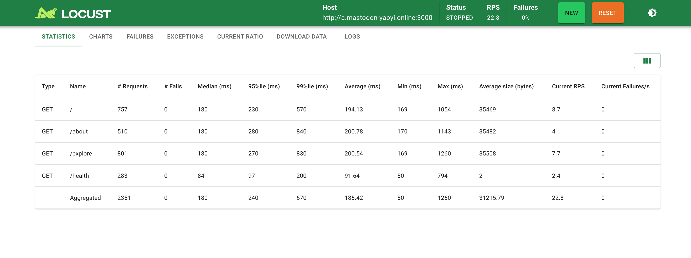

#### 100 Users

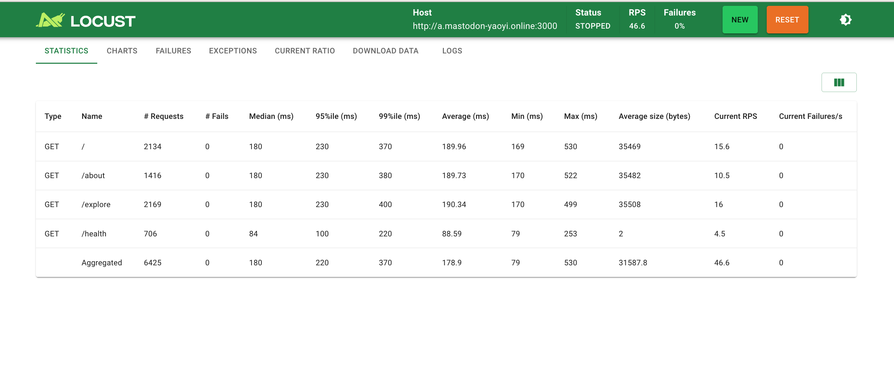

#### 200 Users

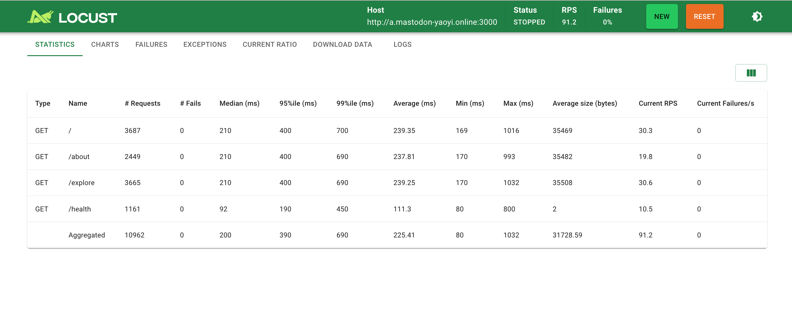

#### 500 Users

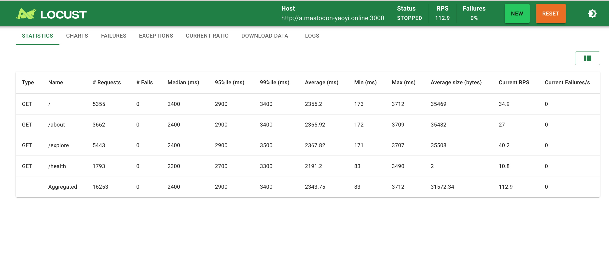

---

### Summary Table

| Load Level | Avg Latency (ms) | P95 (ms) | P99 (ms) | RPS | Failures |
|-----------|------------------:|---------:|---------:|----:|---------:|
| 5 users | 173 | 220 | 290 | 2.2 | 0 (0%) |
| 20 users | 170 | 200 | 290 | 9.4 | 0 (0%) |
| 50 users | 185 | 240 | 670 | 22.8 | 0 (0%) |
| 100 users | 179 | 220 | 370 | 46.6 | 0 (0%) |
| 200 users | 225 | 390 | 690 | 91.2 | 0 (0%) |
| 500 users | 2344 | 2900 | 3400 | 112.9 | 0 (0%) |

**Key finding:** Zero failures at all load levels. Throughput grew steadily up to 200 users, then plateaued at 500 users while latency increased sharply (225ms → 2344ms avg), indicating the instance approached saturation around 200–500 users. Web container showed the highest CPU usage under load.

---

### Docker Stats Under Load

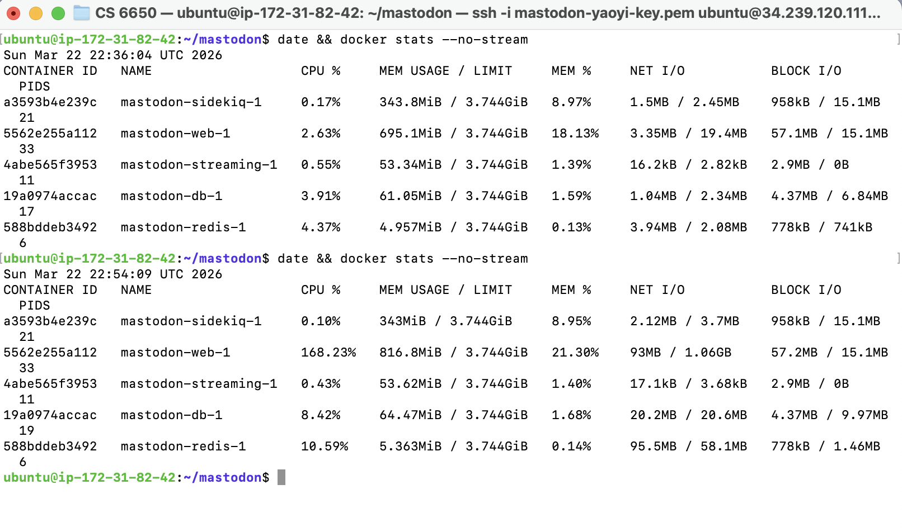

### CloudWatch CPU

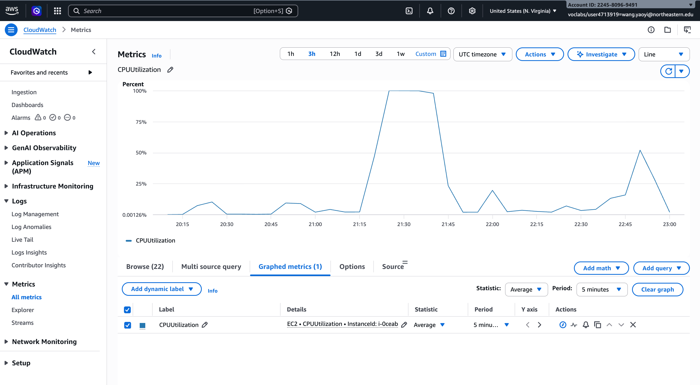

---

## Experiment 2 — Authenticated API Load Test + Rate Limiter Behavior (Instance B, Yehe)

**Workload:** Authenticated API — POST status (3x), GET home timeline (5x), GET public timeline (3x), GET notifications (2x), favourite (1x), search (1x)
**Tool:** Locust

### Instance Running

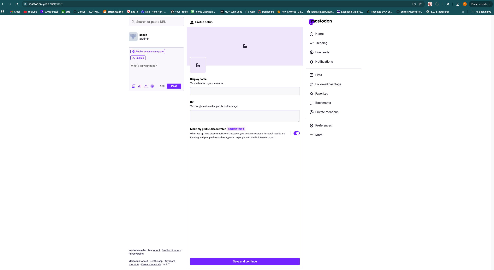

---

### Load Test Results

#### Smoke Test — 5 Users, 60s

| Endpoint | Requests | Failures | p50 | p95 | p99 | RPS |
|---|---|---|---|---|---|---|
| POST /api/v1/statuses | 77 | 0 (0%) | 95ms | 150ms | 310ms | 1.30 |
| GET /timelines/home | 67 | 0 (0%) | 180ms | 280ms | 410ms | 1.14 |
| GET /timelines/public | 22 | 0 (0%) | 170ms | 210ms | 370ms | 0.37 |
| GET /notifications | 22 | 0 (0%) | 110ms | 190ms | 240ms | 0.37 |
| GET /api/v2/search | 11 | 0 (0%) | 62ms | 180ms | 180ms | 0.19 |
| **Aggregated** | **213** | **0 (0%)** | **130ms** | **230ms** | **310ms** | **3.61** |

#### Baseline — 20 Users, 300s

| Endpoint | Requests | Failures | Failure % | p50 | p95 | p99 | RPS |
|---|---|---|---|---|---|---|---|
| POST /api/v1/statuses | 1,383 | 834 | 60.3% | 82ms | 400ms | 670ms | 4.62 |
| GET /timelines/home | 1,153 | 668 | 57.9% | 100ms | 470ms | 790ms | 3.85 |
| GET /timelines/public | 591 | 280 | 47.4% | 170ms | 430ms | 700ms | 1.97 |
| GET /notifications | 404 | 215 | 53.2% | 110ms | 570ms | 970ms | 1.35 |
| GET /api/v2/search | 184 | 103 | 56.0% | 61ms | 200ms | 310ms | 0.61 |
| **Aggregated** | **4,041** | **2,226** | **55.1%** | **94ms** | **440ms** | **740ms** | **13.49** |

All failures: HTTP 429 Too Many Requests.

#### Stress Test — 50 Users, 300s

| Endpoint | Requests | Failures | Failure % | p50 | p95 |
|---|---|---|---|---|---|
| POST /api/v1/statuses | 3,129 | 3,029 | 96.8% | 92ms | 1,300ms |
| GET /timelines/home | 2,669 | 2,011 | 75.3% | 91ms | 1,700ms |
| GET /timelines/public | 1,276 | 819 | 64.2% | 100ms | 1,500ms |
| GET /notifications | 853 | 663 | 77.7% | 89ms | 1,900ms |
| GET /api/v2/search | 474 | 344 | 72.6% | 96ms | 1,200ms |
| **Aggregated** | **8,990** | **7,212** | **80.2%** | **94ms** | **1,500ms** |

All failures: HTTP 429 Too Many Requests.

---
### Sidekiq Monitor Result

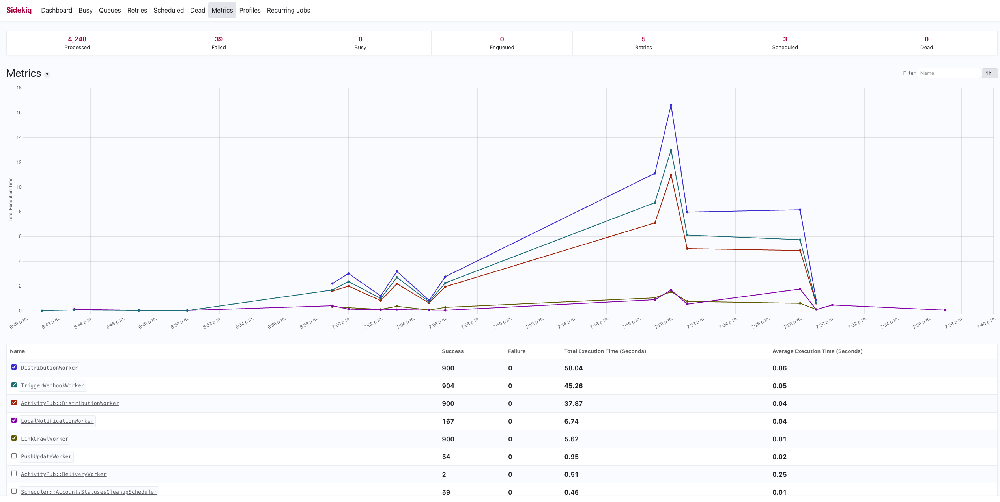

Sidekiq metrics showed a peak during the 5-user test; in subsequent 20- and 50-user tests, the rate limiter intervened and prevented additional tasks from being enqueued.

---

### EC2 CPU During Load Tests

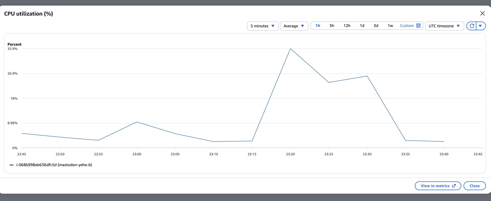

| Test | EC2 CPU Peak | Web Container CPU | DB CPU | Sidekiq |
|---|---|---|---|---|
| 5 users (smoke) | ~5% | normal | normal | processing |
| 20 users (baseline) | 35.9% | elevated | 11% | processing |
| 50 users (stress) | ~26% | 177% (1 core) | 11% | idle |

---

### Load Test Progression Summary

| Load Level | Error Rate | p50 | p95 | RPS | Bottleneck |
|---|---|---|---|---|---|
| 5 users (smoke) | 0% | 130ms | 230ms | 3.6 | None |
| 20 users (baseline) | 55.1% | 94ms | 440ms | 13.5 | Rate limiter begins |
| 50 users (stress) | 80.2% | 94ms | 1,500ms | 30.0 | Rate limiter + web CPU 177% |

**Key findings:**
- Rate limiter (`rack-attack`) activates before hardware saturation — 429s appear at 20 users
- Web container hit 177% CPU (one full core) at 50 users while DB stayed at 11%
- Sidekiq starved: no successful POST = no jobs enqueued = Sidekiq idle
- p50 latency improved at 50 users (130ms → 94ms) because instant 429 rejections pulled the median down
- **Next step:** disable rate limiting (`RACK_ATTACK_ENABLED=false`) to find true hardware saturation point

---

## Experiment 3 — Federation Validation (Instance A ↔ Instance B)

Federation was validated after Instance A was upgraded to HTTPS + Nginx (Let's Encrypt).

### Federation Checks

| Check | Result |
|---|---|
| Remote account discovery (`@admin@mastodon-yehe.click` from Instance A) | ✅ Success |
| Mutual follow between instances | ✅ Success |
| Remote public post visible on home timeline | ✅ Success |
| Remote like / favorite notification received | ✅ Success |

### Screenshots

#### Mutual Follow

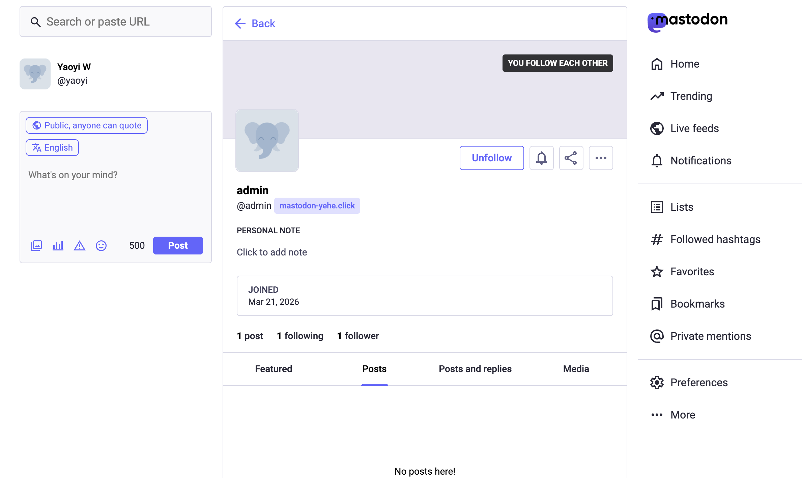

#### Remote Profile Visible

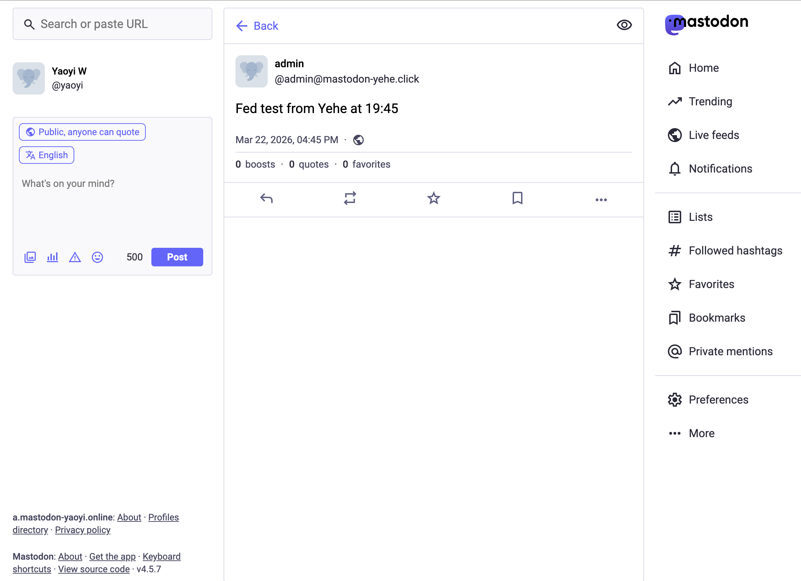

#### Remote Post Visible

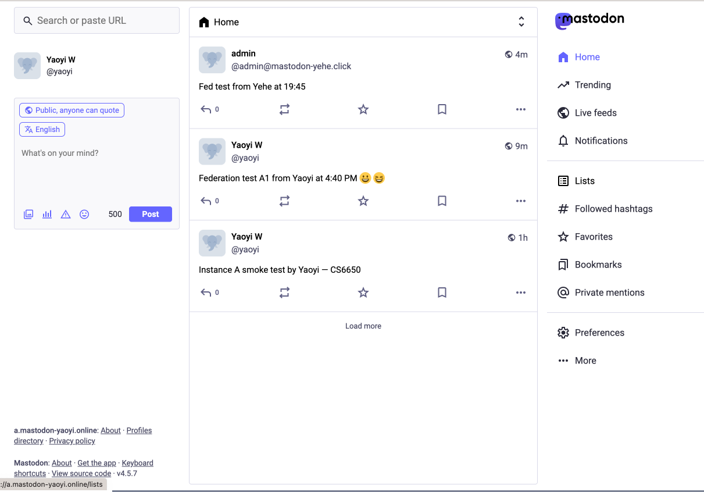

#### Remote Like Notification

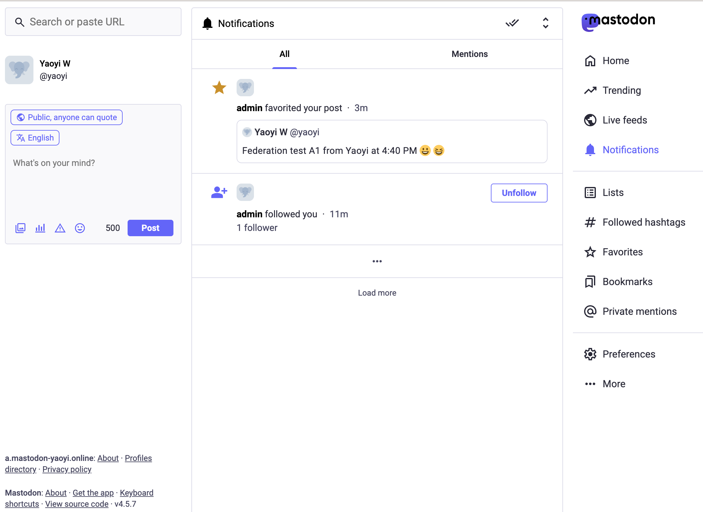

---

**Key finding:** Federation required HTTPS + Nginx — direct HTTP on port 3000 was insufficient for WebFinger / ActivityPub discoverability. Once both instances were production-configured, all four federation checks passed. Quantitative propagation latency measurement is a next step.

---

## Deployment Pivot — CloudFormation Failure Evidence

The original deployment path (CloudFormation + ECS Fargate) was abandoned after 5 failed attempts due to Learner Lab IAM restrictions.

| Template Version | Failed Resource | Root Cause |
|---|---|---|
| v1 | `EmailIdentity`, `LambdaRole` | SES + IAM role creation blocked |
| v2 | `BucketPolicyPublic` | S3 Block Public Access |
| v3/v4 | `FlowLogModule` | VPC flow logs require IAM role creation |
| v5 | `TaskRole` / `TaskExecutionRole` | ECS task IAM roles fundamentally blocked |

### Stack Failure Screenshots

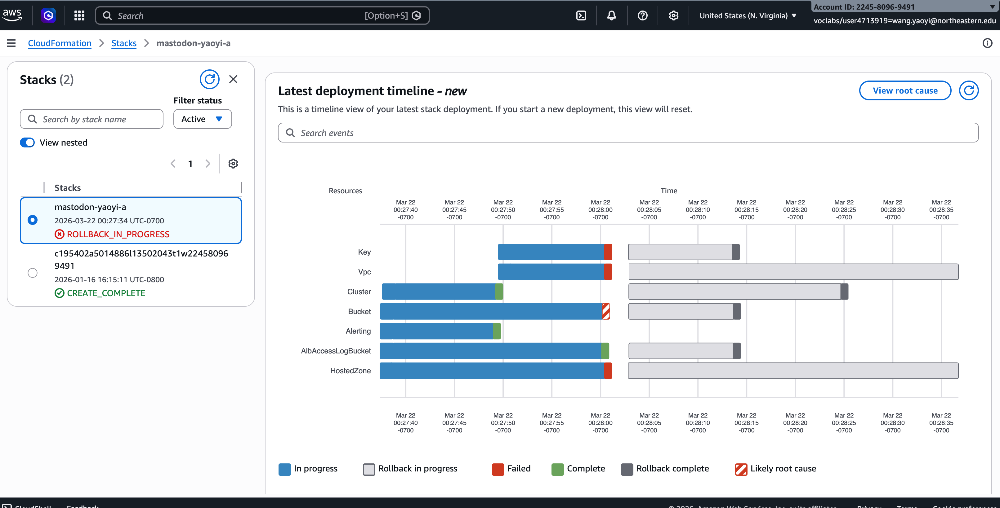

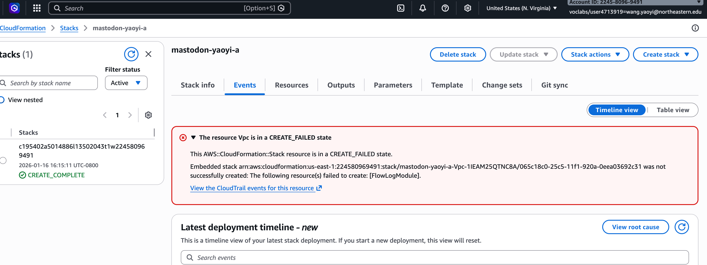

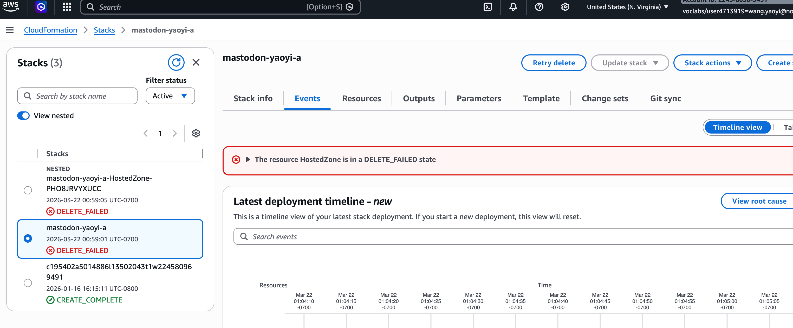

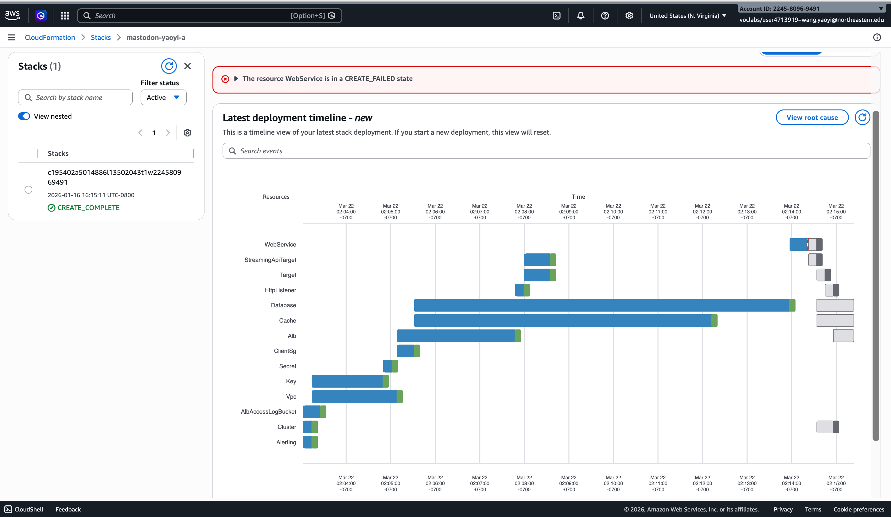