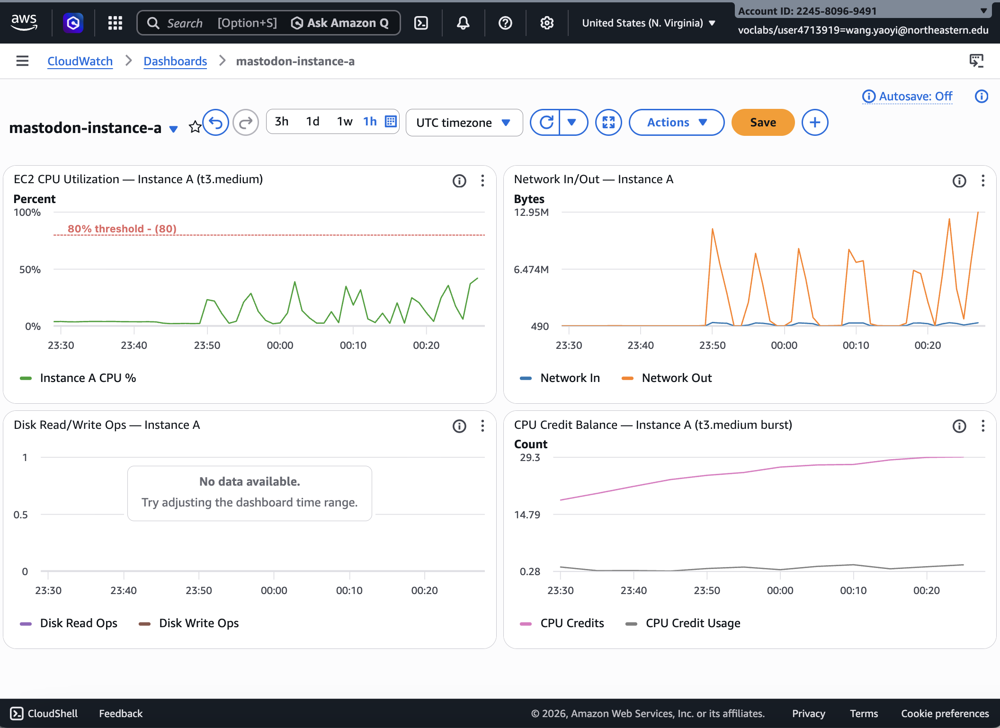

# Results and Graphs
## Mastodon Scaling Study — CS6650 Spring 2026
**Team:** Yaoyi Wang & Yehe Yan

---

## Architecture Overview

| | Instance A (Yaoyi) | Instance B (Yehe) |
|---|---|---|
| Domain | `a.mastodon-yaoyi.online` | `mastodon-yehe.click` |
| EC2 | t3.medium (2 vCPU, 4GB RAM) | t3.large (2 vCPU, 8GB RAM) |
| Stack | EC2 + Docker Compose + Nginx + HTTPS | EC2 + Docker Compose + Nginx + HTTPS |

---

## Experiment 1 — Single Instance Bottleneck (Instance A, Yaoyi)

**Workload:** Anonymous read traffic — `/`, `/about`, `/explore`, `/health`
**Tool:** Locust | **Instance:** t3.medium

### Deployment

### Load Test Results

| Load Level | Avg Latency (ms) | P95 (ms) | P99 (ms) | RPS | Failures |
|-----------|------------------:|---------:|---------:|----:|---------:|
| 5 users | 173 | 220 | 290 | 2.2 | 0% |
| 20 users | 170 | 200 | 290 | 9.4 | 0% |
| 50 users | 185 | 240 | 670 | 22.8 | 0% |
| 100 users | 179 | 220 | 370 | 46.6 | 0% |
| 200 users | 225 | 390 | 690 | 91.2 | 0% |
| 500 users | 2,344 | 2,900 | 3,400 | 112.9 | 0% |

**Key finding:** Zero failures at all load levels. Throughput plateaued at 500 users while latency jumped from 225ms to 2,344ms avg. Web container showed highest CPU usage; PostgreSQL and Redis remained lightly loaded.

---

## Experiment 1B — Authenticated Load + Rate Limiter (Instance B, Yehe)

**Workload:** Authenticated API — POST status (3x), GET home timeline (5x), GET public timeline (3x), GET notifications (2x), favourite (1x), search (1x)
**Tool:** Locust | **Instance:** t3.large

### Smoke Test — 5 Users, 60s

| Endpoint | Requests | Failures | p50 | p95 | p99 | RPS |
|---|---|---|---|---|---|---|
| POST /api/v1/statuses | 77 | 0% | 95ms | 150ms | 310ms | 1.30 |
| GET /timelines/home | 67 | 0% | 180ms | 280ms | 410ms | 1.14 |
| GET /timelines/public | 22 | 0% | 170ms | 210ms | 370ms | 0.37 |
| GET /notifications | 22 | 0% | 110ms | 190ms | 240ms | 0.37 |
| **Aggregated** | **213** | **0%** | **130ms** | **230ms** | **310ms** | **3.61** |

### Baseline — 20 Users, 300s

| Endpoint | Requests | Failures | Failure % | p50 | p95 | RPS |
|---|---|---|---|---|---|---|
| POST /api/v1/statuses | 1,383 | 834 | 60.3% | 82ms | 400ms | 4.62 |
| GET /timelines/home | 1,153 | 668 | 57.9% | 100ms | 470ms | 3.85 |
| GET /timelines/public | 591 | 280 | 47.4% | 170ms | 430ms | 1.97 |
| **Aggregated** | **4,041** | **2,226** | **55.1%** | **94ms** | **440ms** | **13.49** |

All failures: HTTP 429 Too Many Requests.

### Stress Test — 50 Users, 300s

| Endpoint | Requests | Failures | Failure % | p50 | p95 |
|---|---|---|---|---|---|
| POST /api/v1/statuses | 3,129 | 3,029 | 96.8% | 92ms | 1,300ms |
| GET /timelines/home | 2,669 | 2,011 | 75.3% | 91ms | 1,700ms |
| **Aggregated** | **8,990** | **7,212** | **80.2%** | **94ms** | **1,500ms** |

### EC2 CPU During Load Tests

| Test | EC2 CPU Peak | Web Container CPU | DB CPU | Sidekiq |
|---|---|---|---|---|
| 5 users | ~5% | normal | normal | processing |
| 20 users | 35.9% | elevated | 11% | processing |
| 50 users | ~26% | 177% (1 core) | 11% | idle |

**Key findings:** Rate limiter activates at 20 users before hardware saturation. Web CPU hit 177% while DB stayed at 11%. Sidekiq starved — no successful POSTs = no jobs enqueued.

---

## Experiment 2 — Bottleneck Shifting (Both Instances)

### Instance B (t3.large) — Yehe

| Step | Change | RPS | Failure Rate | Key Finding |
|------|--------|-----|--------------|-------------|
| Baseline | Default | 13.5 | 55% | rack-attack throttling |
| Step 1 | No rate limit | 12.8 | 33% | Puma exposed, web CPU 138% |
| Step 2 | WC=4 | 9.2 | **0%** | Sweet spot — zero failures |
| Step 3 | WC=6 | 12.5 | 33% | Context switching overhead |
| Step 4 | Nginx cache | ~13 | ~7% | 5× public timeline improvement |

Redis cache hit rate: **84%** — PostgreSQL was never the bottleneck.

### Instance A (t3.medium) — Yaoyi

| Step | Change | RPS | Failure Rate | Key Finding |
|------|--------|-----|--------------|-------------|
| Step 0 | Default | 9.3 | 41.6% | 429 rate limiting, web CPU 58% |
| Step 2 | WC=4 | 9.2 | 42.7% | **502 Bad Gateway appears** |

### Vertical Scaling Comparison

| Metric | Instance A (t3.medium) | Instance B (t3.large) |
|--------|----------------------|----------------------|
| Default failure rate (20u) | 41.6% | 55.1% |
| Default p95 | 300ms | 440ms |
| Default RPS | 9.3 | 13.5 |
| WC=4 failure rate | **42.7%** (worse) | **0%** (eliminated) |
| WC=4 p99 | 1,500ms | 530ms |
| WC=4 502 errors | Yes | No |
| Optimal WEB_CONCURRENCY | 2 | 4 |

**Key finding:** Instance size is a binding constraint for worker scaling. t3.medium cannot absorb WC=4 under load; t3.large handles it cleanly with zero failures.

---

## Experiment 3 — Federation Validation (Instance A ↔ Instance B)

Federation validated after Instance A was upgraded to HTTPS + Nginx.

| Check | Result |
|---|---|
| Remote account discovery | ✅ |
| Mutual follow | ✅ |
| Remote post visible on home timeline | ✅ |
| Remote like notification received | ✅ |

**Key finding:** Federation required HTTPS + Nginx. Direct HTTP on port 3000 broke WebFinger / ActivityPub discoverability.

---

## Deployment Pivot — CloudFormation Failure Evidence

| Version | Failed Resource | Root Cause |
|---------|----------------|------------|
| v1 | `EmailIdentity`, `LambdaRole` | SES + IAM blocked |
| v2 | `BucketPolicyPublic` | S3 Block Public Access |
| v3/v4 | `FlowLogModule` | VPC flow logs require IAM |
| v5 | `TaskRole` / `TaskExecutionRole` | ECS task IAM fundamentally blocked |

